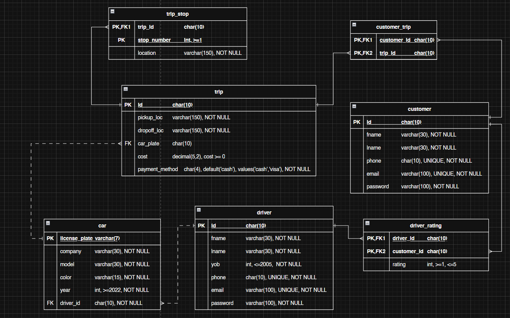

# Sayyartak: Taxi Application Database Management System

## Project Overview

**Sayyartak** ("The car is your car") is a theoretical taxi booking application designed for the Jordanian market to connect drivers and customers. This project implements the backend database layer that supports core features such as trip booking, group rides, driver ratings, and vehicle management.

The system focuses on data integrity through strict normalization (up to Third Normal Form – 3NF) and role-based security, ensuring that business rules—such as vehicle age restrictions and driver eligibility—are enforced directly at the database level.

---

## Scope

This project covers the physical and logical database design, including:

- Entity Relationship (ER) modeling and normalization
- SQL implementation of tables, views, and stored procedures
- Security management through database users, roles, and privileges
- Database maintenance considerations and access control

---

## Core Entities

The system is built around the following normalized entities:

- **Customer:** Stores customer credentials and contact information
- **Driver:** Stores driver credentials, year of birth, and rating-related data
- **Car:** Tracks vehicles linked to drivers (model year must be 2022 or later)
- **Trip:** The core transactional entity linking locations, costs, and vehicles
- **Trip_Stop:** Represents intermediate stops within a single trip
- **Driver_Rating:** Stores 1–5 star ratings given by customers to drivers
- **Customer_Trip:** Junction table used to associate customers with trips

---

## Customer–Trip Relationship Design

The relationship between customers and trips is modeled as a **many-to-many** relationship using the `customer_trip` junction table.

This design explicitly supports the **Group Trip** feature, where multiple customers can participate in a single trip booking. The approach ensures:

- **Normalization:** Prevents partial and transitive dependencies found in earlier design iterations
- **Flexibility:** Allows future support for cost splitting or multi-passenger tracking without modifying the core `trip` table

---

## Database Schema
The following Entity Relationship (ER) diagram illustrates the physical schema of the database, highlighting relationships and cardinality between entities such as Drivers, Trips, and Customers.

---

## Database Guarantees and Constraints

The database enforces strict business rules to ensure data validity and consistency:

- **Driver Eligibility:** Drivers must meet minimum age requirements enforced through year-of-birth checks
- **Vehicle Standards:** Only vehicles manufactured in 2022 or later are permitted
- **Referential Integrity:**
  - `ON DELETE CASCADE` is used where dependent data should be removed automatically (e.g., customer ratings and trip links)
  - `ON DELETE RESTRICT` is used to protect critical operational data such as trips and drivers from accidental deletion
- **Normalization:** The schema is optimized to Third Normal Form (3NF) to eliminate redundancy and transitive dependencies

---

## Views

To simplify reporting and operational querying, the following database views are implemented:

- **`driver_info`**: Aggregates driver details, total trips completed, and average ratings
- **`customer_info`**: Summarizes customer contact details and trip history
- **`trip_info`**: Consolidates trip logistics, costs, and driver–vehicle assignments
- **`car_info`**: Displays vehicle details along with associated driver information

---

## Stored Procedures

Stored procedures encapsulate business logic and provide controlled access to the database:

- **`book_trip`**: Allows customers to initialize a trip with pickup and drop-off locations and payment method
- **`additional_Tdetail`**: Enables technical support to assign vehicles and finalize trip costs
- **`see_driver_trips`**: Retrieves the complete trip history for a specific driver
- **`see_car_trips`**: Retrieves usage history for a specific vehicle

---

## Users and Permissions

Security is implemented using role-based access control following the principle of least privilege:

1. **Customer Role (`customer`)**
   - Permissions: `INSERT` on `customer`, `trip_stop`, and `driver_rating`
   - Execution rights: `book_trip`

2. **Driver Role (`driver`)**
   - Permissions: `INSERT` on `driver` and `car` tables for registration purposes

3. **Technical Support Role (`technical`)**
   - Permissions:
     - `SELECT` on all informational views (`*_info`)
     - `SELECT`, `UPDATE`, `DELETE` on operational tables (`trip_stop`, `driver_rating`, `customer_trip`) for issue resolution
   - Execution rights: All support-related stored procedures

Passwords defined in this project are placeholders and are used strictly for demonstration purposes.

---

## Limitations

- **Single Vehicle per Trip:** Each trip is assigned to exactly one vehicle
- **Static Pricing:** Trip costs are manually assigned or updated; no dynamic pricing logic is implemented
- **No Concurrency Control:** The design prioritizes structural correctness over high-concurrency transaction handling
